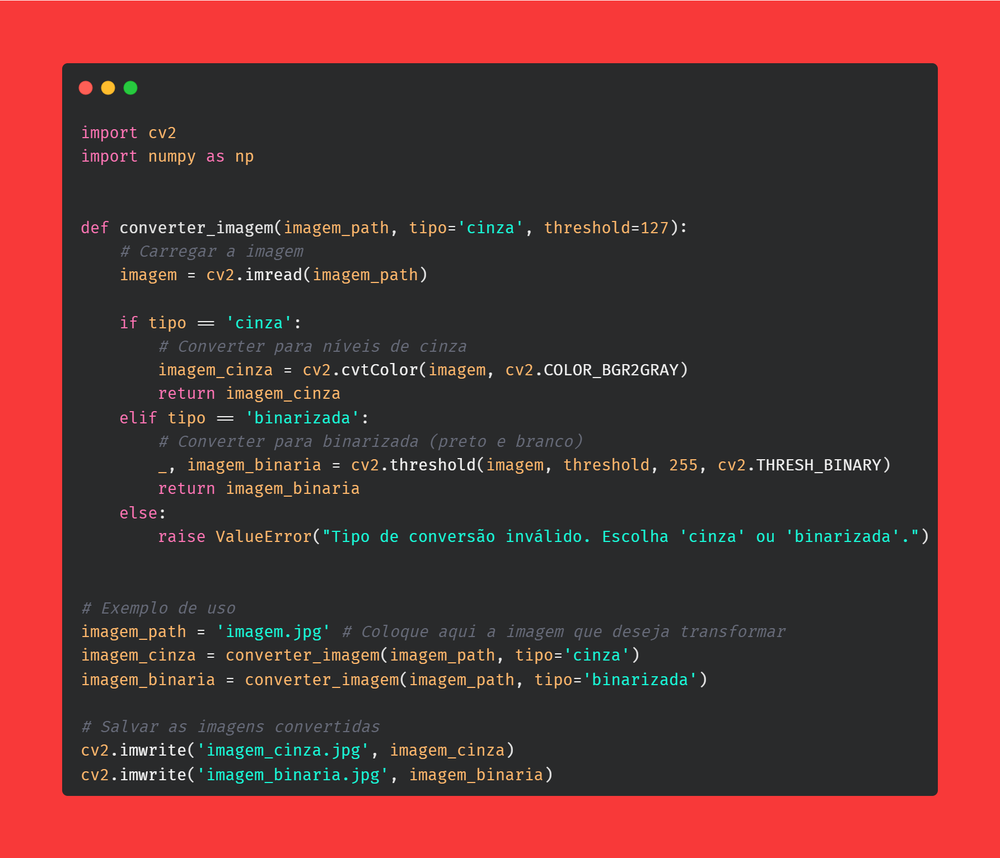

# Projeto em Python para reduzir a dimensionalidade das imagens

## Conversor de Imagens com OpenCV
Este projeto utiliza a biblioteca OpenCV para converter imagens para dois tipos diferentes: níveis de cinza e binarizada (preto e branco). A função `converter_imagem` lê a imagem a partir de um caminho especificado, realiza a conversão desejada e retorna a imagem convertida.

## Para que serve este código
- **Converter imagens para níveis de cinza**: Reduzindo uma imagem colorida para tons de cinza.
- **Converter imagens para binarizada**: Transformando a imagem para apenas duas cores (preto e branco) com base em um limiar de intensidade (threshold).

## Como o código funciona:
### Importação de bibliotecas
- `cv2` é a biblioteca OpenCV para processamento de imagens.
- `numpy` é usada para manipulação de arrays.

### Função `converter_imagem`
**Parâmetros:**
- `imagem_path`: Caminho da imagem a ser carregada.
- `tipo`: Tipo de conversão ('cinza' para níveis de cinza, 'binarizada' para preto e branco).
- `threshold`: Valor do limiar para a conversão binarizada (padrão é 127).
**Carregamento da imagem:** A imagem é carregada a partir do caminho fornecido.
**Conversão:**
- Se o tipo for `'cinza'`, a imagem é convertida para níveis de cinza.
- Se o tipo for `'binarizada'`, a imagem é convertida para preto e branco com base no valor do limiar.
- Se o tipo for inválido, uma exceção é levantada.
- 
### Exemplo de uso
1. Carrega uma imagem a partir de `'imagem.jpg'`.
2. Converte a imagem para níveis de cinza e binarizada.
3. Salva as imagens convertidas como `'imagem_cinza.jpg'` e `'imagem_binaria.jpg'`.

## Aplicações
Este código pode ser útil para processamento de imagens em diversas aplicações, como análise de imagens, visão computacional, e preparação de dados para algoritmos de machine learning. 📸👩‍💻

